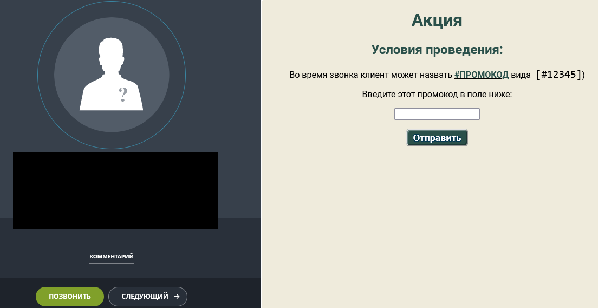

Пример виджета-встройку в карточку звонка Битрикс24

Менеджеру поступает звонок, всплывает карточка в Битриксе. 

Клиент называет промокод, менеджер вводит его в поле и нажимает "Отправить".
Допустим, должно выполняться 2 условия:
    - клиент не присутствует у нас в базе (только для новых клиентов)
    - по этому номеру телефона нет записи в списке акции (промокодом можно воспользоваться только один раз)

Происходят данные проверки, после успешного прохождения данные заносятся в список с IBLOCK_ID=123 (правится в handler.php)

